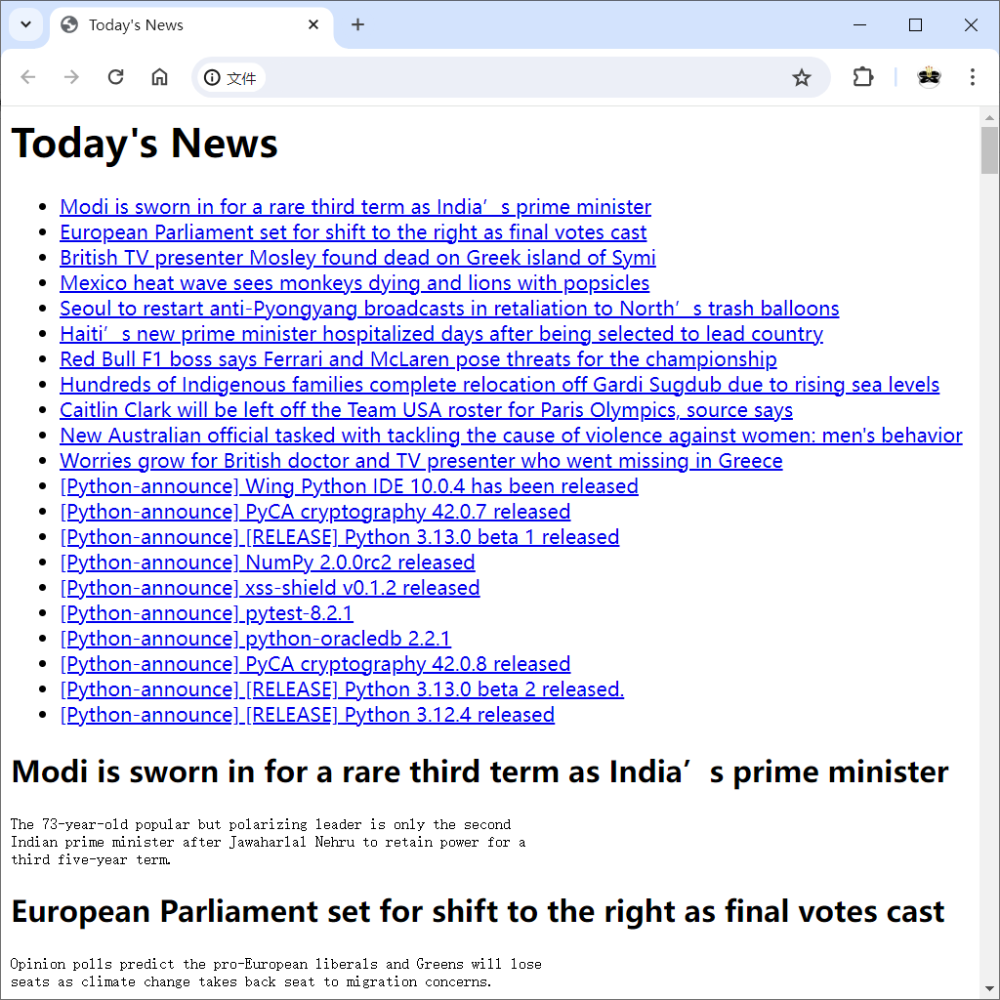

# 项目4：新闻汇总
## 目标
编写一个信息收集代理，能够收集新闻并生成报告。
* 能够从众多不同的来源收集新闻。
* 能够以多种不同的格式将生成的新闻报告分发到众多不同的目的地。

## 代码
初次实现
* [代码清单23-1 简单的新闻收集代理](newsagent1.py)

再次实现
* [代码清单23-2 更灵活的新闻收集代理](newsagent2.py)

## 运行

```shell
$ python newsagent2.py
```

## 截图

