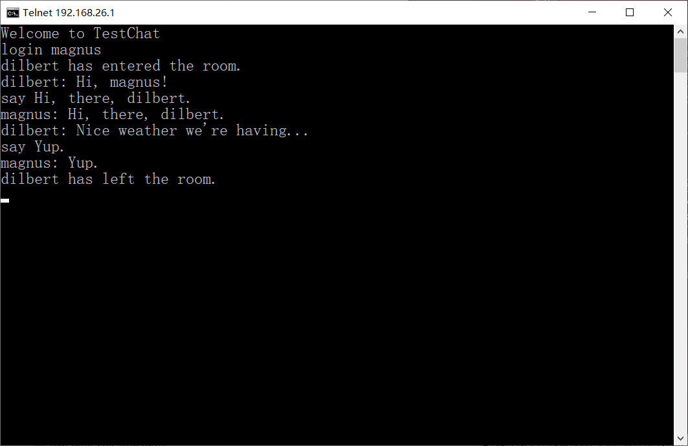
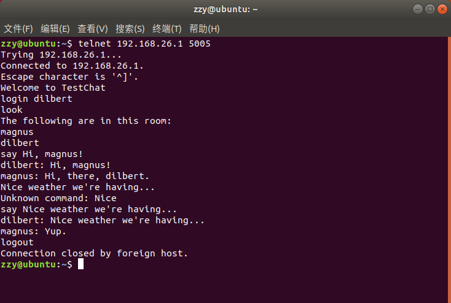

# 项目5：虚拟茶话会
## 目标
编写一个聊天服务器，让人们能够通过网络实时聊天。
* 服务器应该能接受来自不同用户的多个连接。
* 应该允许用户并行操作。
* 应该能够解释命令（例如`say`或`logout`）。
* 服务器应该易于扩展。

## 代码
初次实现
* [代码清单24-5 简单的聊天服务器](simple_chat.py)

再次实现
* [代码清单24-6 稍复杂些的聊天服务器](chatserver.py)

## 运行
启动服务器：

```shell
$ python chatserver.py
```

客户端连接：

```shell
$ telnet some.host.name 5005
```

其中some.host.name是服务器的地址（机器名或IP地址）。

聊天服务器支持的命令：

| 命令 | 描述 |
| --- | --- |
| `login name` | 用于登录服务器 |
| `logout` | 用于退出服务器 |
| `say statement` | 用于发言 |
| `look` | 用于查看谁在同一个聊天室 |
| `who` | 用于查看谁登录到了服务器 |

## 截图



