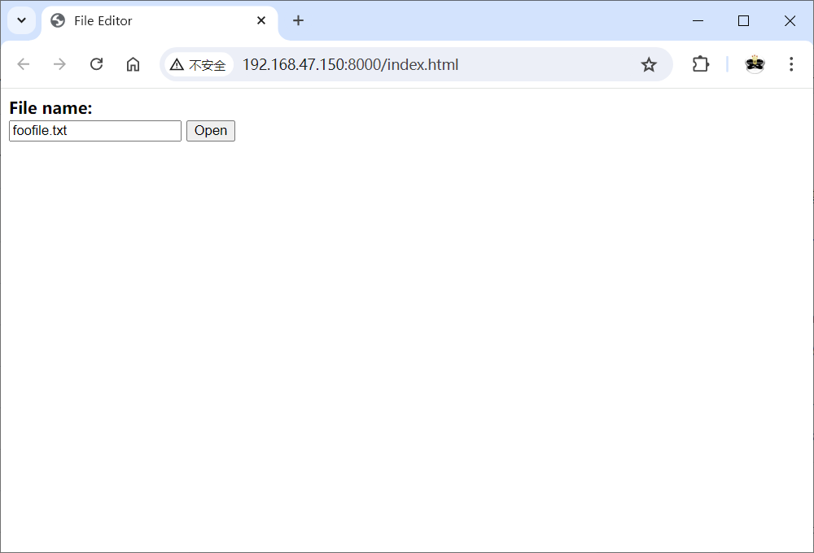
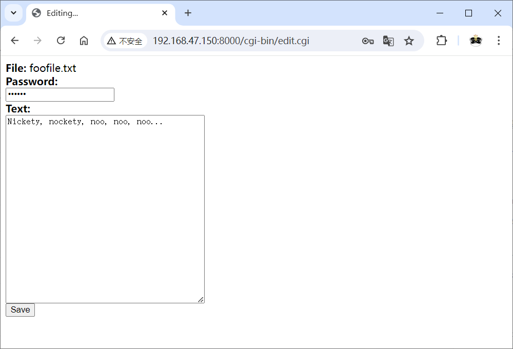

# 项目6：使用CGI进行远程编辑
## 目标
在一台机器上通过Web来编辑存储在另一台机器上的文档。
* 应该能够将文档显示为普通网页。
* 应该能够在Web表单的文本域内显示文档。
* 用户能够保存表单中的文本。
* 程序应该使用密码保护文档。
* 程序应该易于扩展以支持对多个文档进行编辑。

## 代码
初次实现
* [代码清单25-1 简单的Web编辑器](cgi-bin/simple_edit.cgi)

再次实现
* [首页](index.html)
* [代码清单25-2 编辑器脚本](cgi-bin/edit.cgi)
* [代码清单25-3 保存脚本](cgi-bin/save.cgi)

## 运行
启动服务器：

```shell
$ python -m http.server --cgi
```

注意：如果在Windows上运行，则需要将脚本后缀改为.py，同时修改index.html和edit.py中表单的`action`属性值。

使用步骤：
1. 在浏览器中访问 <http://some.host.name:8000/index.html> ，其中some.host.name是服务器的地址（机器名或IP地址）。
2. 输入文件名，点击Open。
3. 编辑文件，输入密码(foobar)，点击Save。

## 截图



