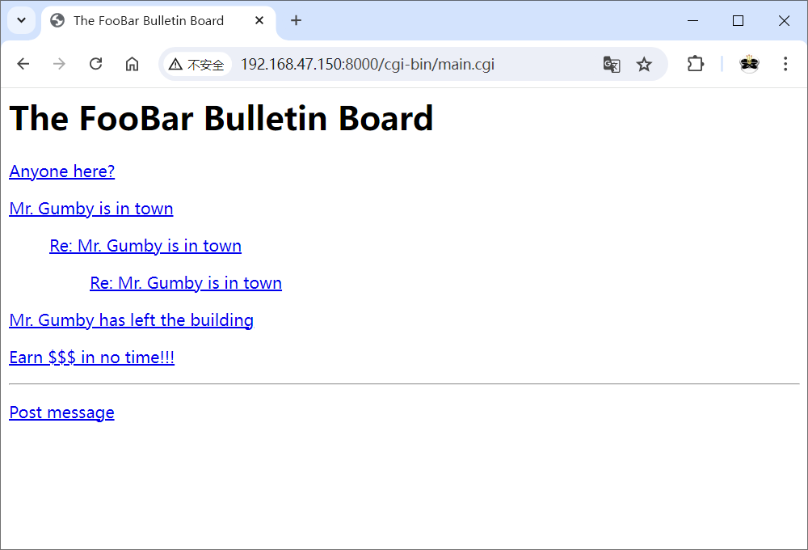
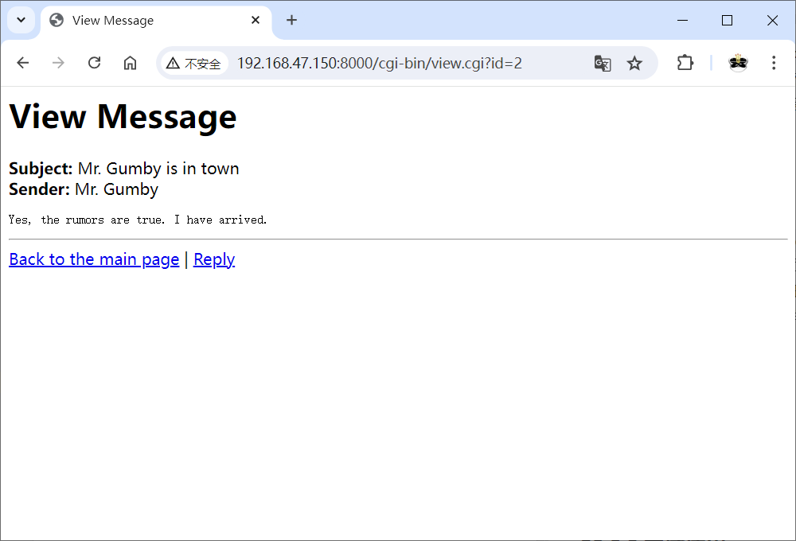
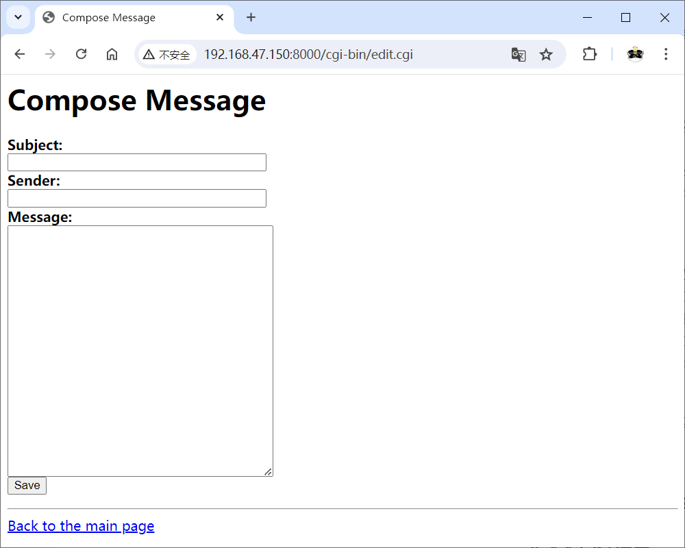

# 项目7：自建公告板
## 目标
创建一个通过Web发布和回复消息的简单系统，可以作为论坛(discussion forum)使用。
* 显示当前所有消息的主题。
* 支持消息主题帖(threading)（在消息下方缩进显示回复）。
* 用户能够查看现有的消息。
* 用户能够回复现有的消息。

## 代码
初次实现
* [代码清单26-4 公告板主页](cgi-bin/simple_main.cgi)

再次实现
* [代码清单26-5 公告板主页](cgi-bin/main.cgi)
* [代码清单26-6 消息查看器](cgi-bin/view.cgi)
* [代码清单26-7 消息编辑器](cgi-bin/edit.cgi)
* [代码清单26-8 保存脚本](cgi-bin/save.cgi)

## 运行
（1）创建数据库

```shell
$ python execute_sql.py messages.db create_table_sqlite.sql
```

（2）导入测试数据（可选）

```shell
$ python execute_sql.py messages.db testdata/messages.sql
```

（3）启动服务器

```shell
$ python -m http.server --cgi
```

（4）在Web浏览器中访问主页 <http://localhost:8000/cgi-bin/simple_main.cgi>

注意：如果在Windows上运行，则需要将脚本后缀改为.py，同时修改表单的`action`属性值。

使用步骤：
* 要发布消息，首先打开主页，点击 "Post message" 链接。在编辑页面填写表单，点击Save按钮，将显示消息 "Message Saved" 。点击 "Back to the main page" 链接回到主页，列表中应该包含刚才发布的消息。
* 要查看消息，只需点击其主题。在查看页面，点击 "Reply" 链接，将再次打开编辑页面，但设置了默认主题。同样，输入一些文本，点击Save按钮，回到主页。你的回复应该显示在原来主题的下方。

## 截图





