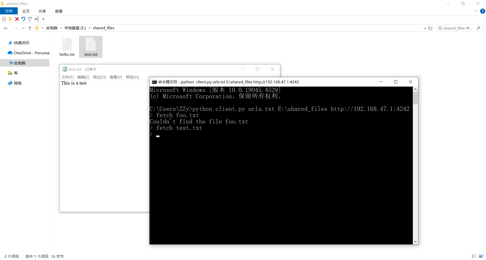
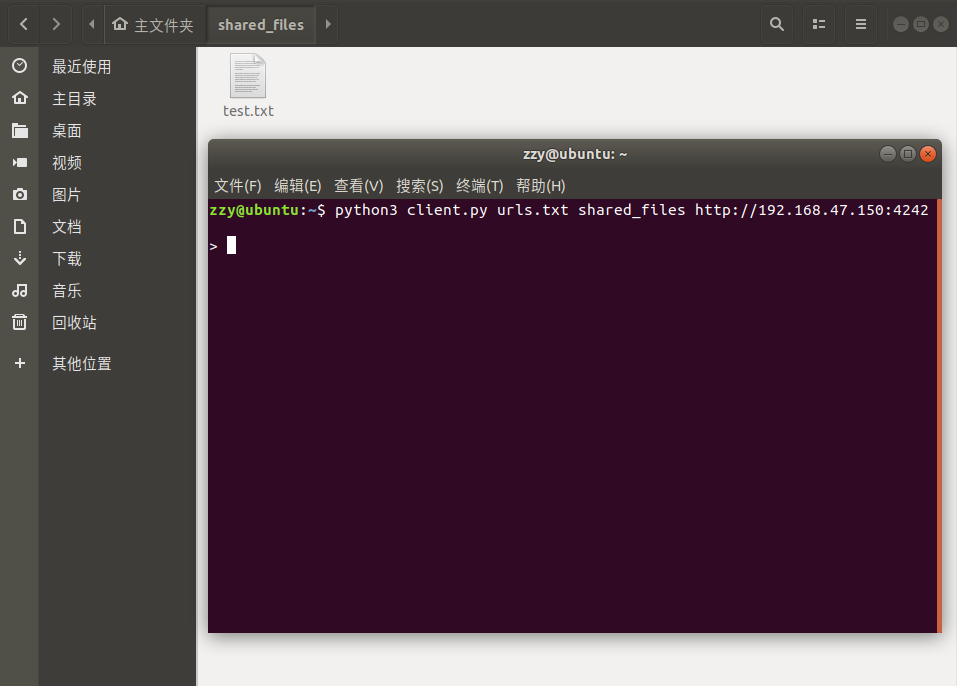

# 项目8：使用XML-RPC进行文件共享
## 目标
创建一个P2P文件共享程序。
* 每个节点必须跟踪已知节点的集合，以便向其寻求帮助。节点必须能够将自己介绍给其他节点（从而添加到其他节点的这个集合中）。
* 必须能够向节点请求文件（通过提供文件名）。如果节点有这个文件，应该将其返回；否则，应该依次向其邻居请求这个文件（而这些邻居可能转而向其邻居请求该文件）。如果某个节点有这个文件，就将其返回。
* 为了避免循环（A请求B，B又请求A），同时避免过长的请求链（A请求B请求C……请求Z），请求节点时必须提供历史记录。这个历史记录就是此前已查询过的节点列表。通过不向历史记录中已有的节点请求，可以避免循环；而通过限制历史记录的长度，可以避免请求链过长。
* 用户必须能够连接到其他节点，并将自己标识为可信任方。通过这样做，用户应该能够使用不可信任方（例如P2P网络中的其他节点）无法使用的功能，包括（通过查询）请求节点从网络中的其他节点下载文件并存储。
* 必须提供用户界面，让用户能够（作为可信任方）连接到节点并下载文件。这种界面应该很容易扩展乃至替换。

## 代码
初次实现
* [代码清单27-1 简单的Node实现](simple_node.py)

再次实现
* [代码清单27-2 新的Node实现（服务器）](server.py)
* [代码清单27-3 Node控制界面（客户端）](client.py)

## 运行
运行以下命令启动一个节点：

```shell
$ python client.py urls.txt directory http://servername.com:4242
```

其中directory是节点的共享文件目录，urls.txt包含所有节点的URL，每行一个。

客户端支持的命令：

| 命令 | 描述 |
| --- | --- |
| `fetch filename` | 从P2P网络下载文件 |
| `exit` | 退出程序 |

## 截图



