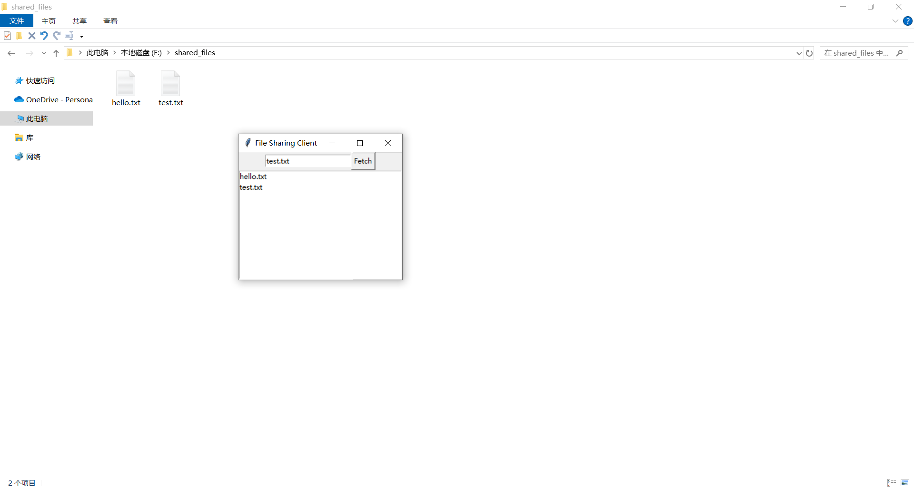

# 项目9：文件共享2——GUI版本
## 目标
扩展项目8开发的文件共享系统，添加GUI客户端。
* 允许用户输入文件名，并将其提交给服务器的`fetch()`方法。
* 列出服务器的文件目录当前包含的文件。

## 代码
初次实现
* [代码清单28-1 简单的GUI客户端](simple_guiclient.py)

再次实现
* [代码清单28-2 最终的GUI客户端](guiclient.py)

## 运行
运行方式与项目8相同：

```shell
$ python guiclient.py urls.txt directory http://servername.com:4242
```

## 截图

