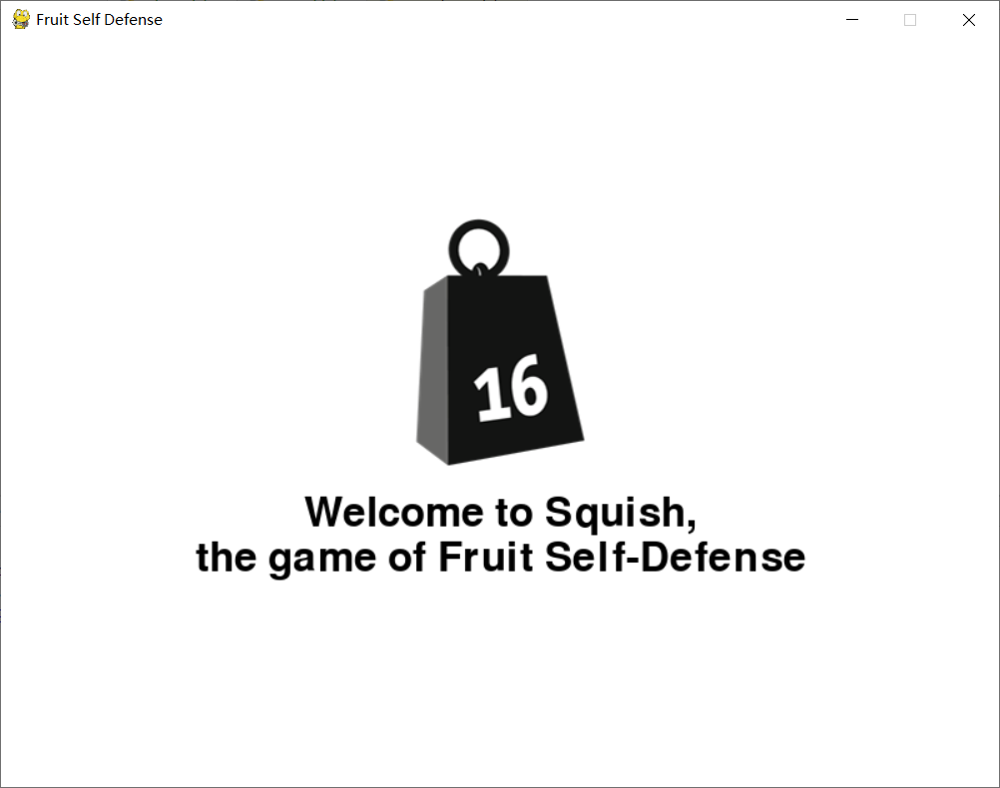
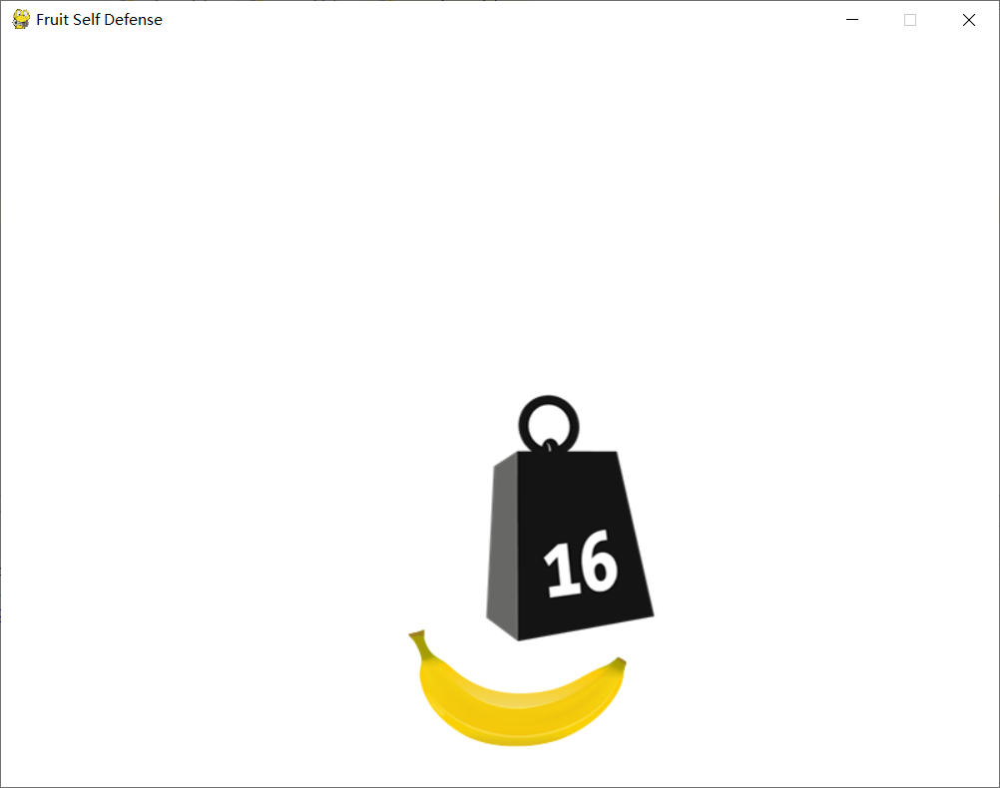
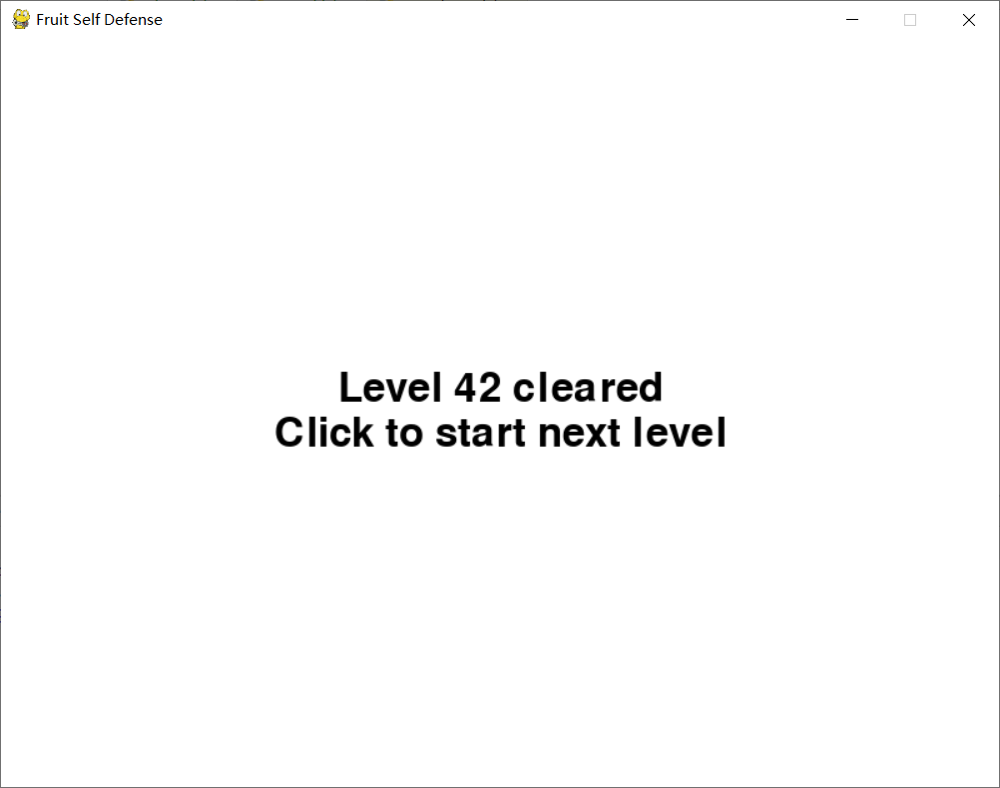
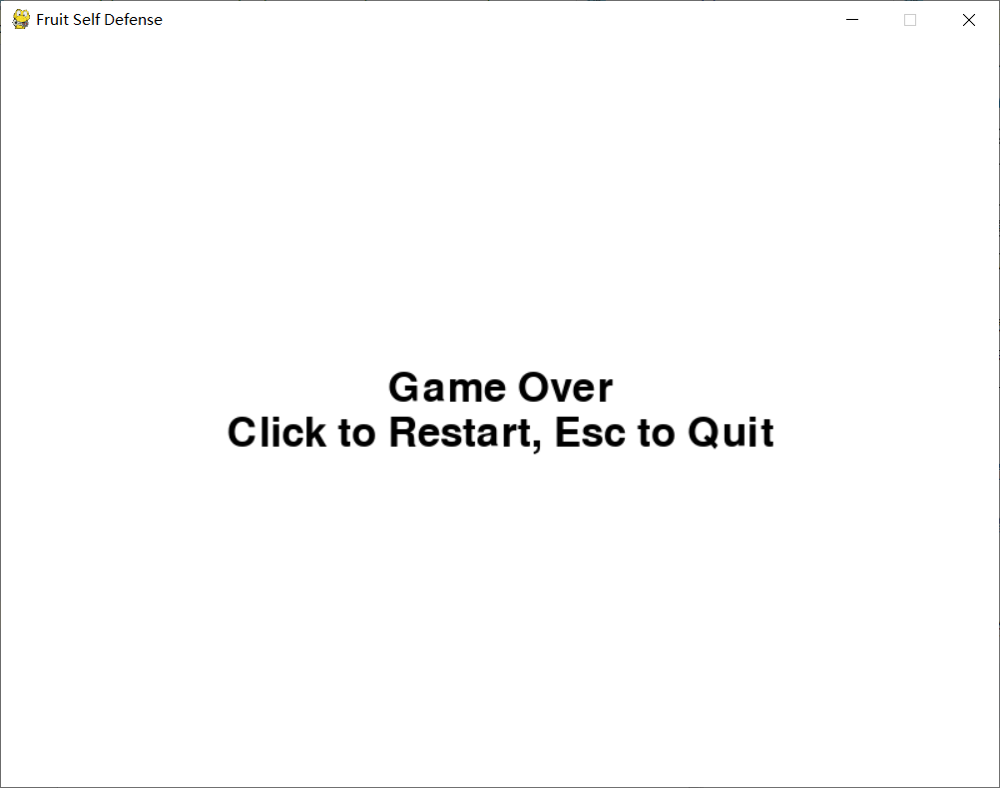

# 项目10：自制街机游戏
## 目标
使用Pygame创建一个街机游戏Squish。在这个游戏中，玩家控制一个香蕉，躲开从天而降的秤砣，尽力在防御战中存活下来。

## 依赖
需要安装Pygame。

```shell
$ pip install pygame
```

## 代码
初次实现
* [代码清单29-1 简单的“掉落秤砣”动画](weights.py)

再次实现
* [代码清单29-2 Squash游戏配置文件](config.py)
* [代码清单29-3 Squash游戏对象](objects.py)
* [代码清单29-4 游戏主模块](squish.py)

## 运行

```shell
$ python squish.py
```

可以修改config.py中的游戏设置。

## 截图







